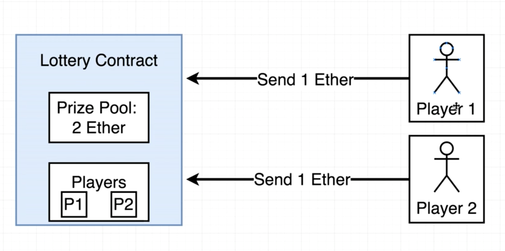
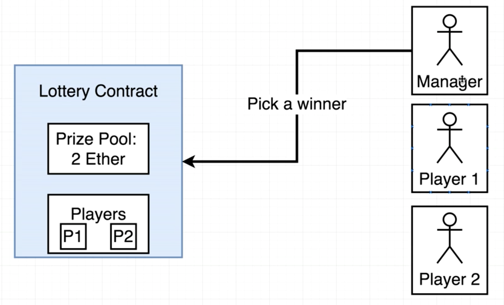
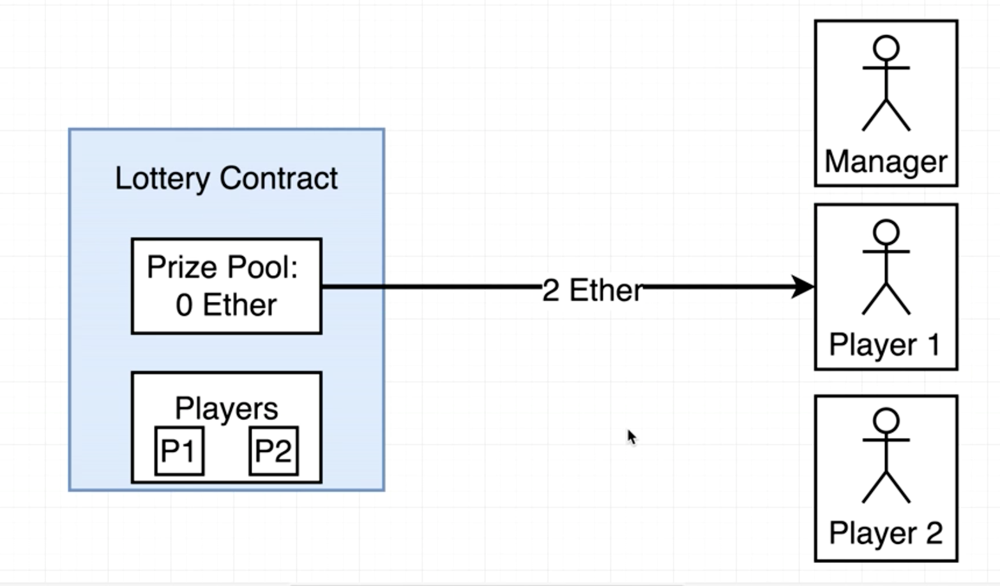
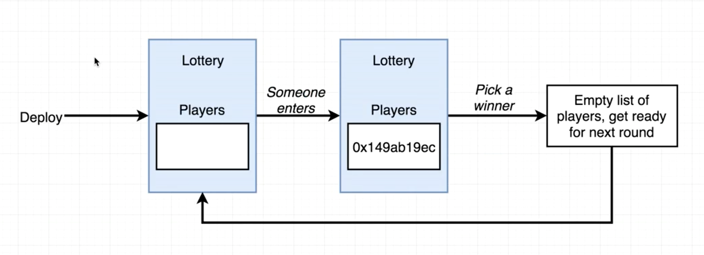
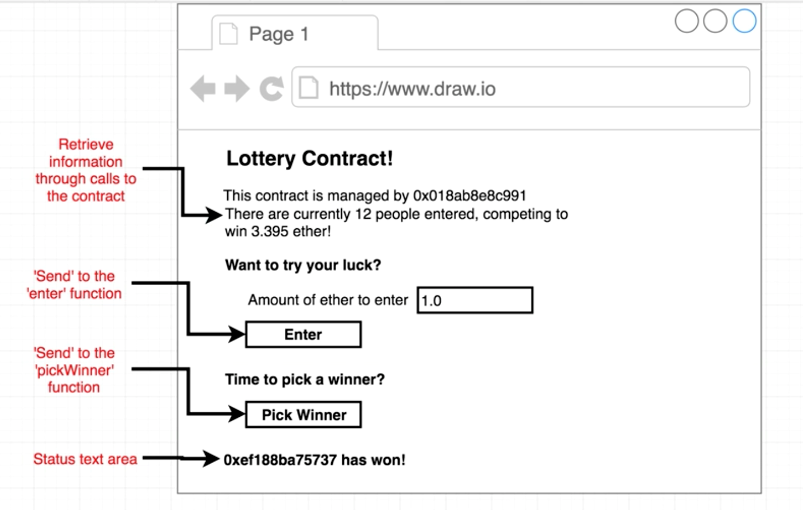
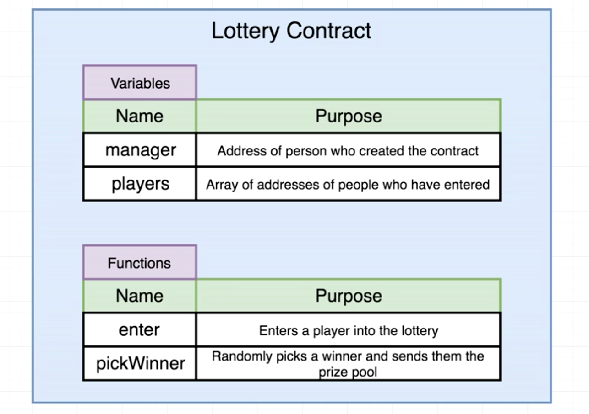
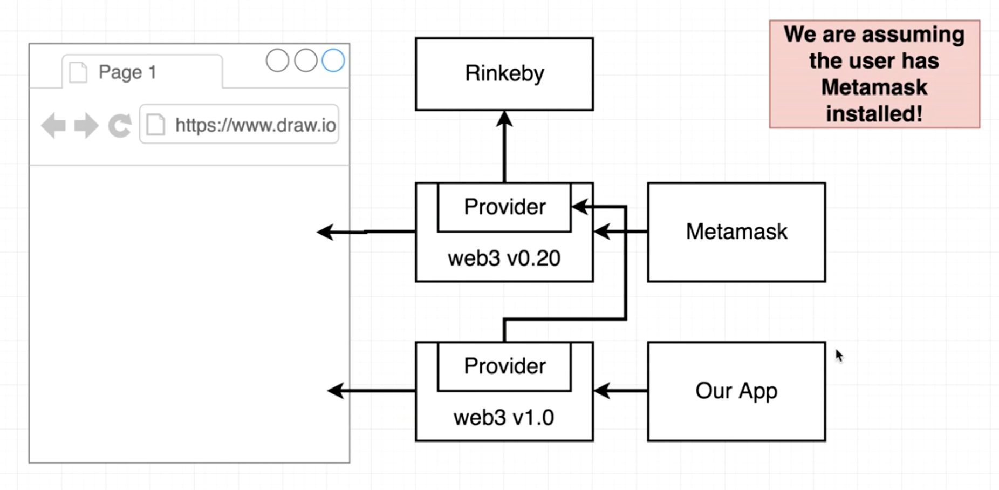
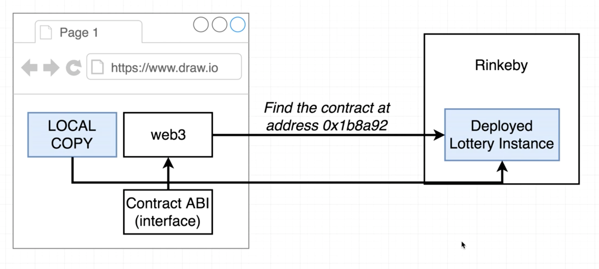

# Dapp, Custom Node + Create React App: Lottery

- Links
  - [Ethereum and Solidity: The Complete Developer's Guide (Section 3 & 4), Udemy](https://www.udemy.com/ethereum-and-solidity-the-complete-developers-guide/learn/v4/content)
  - [Dapp, Custom Node: ToDo, Github](https://github.com/liuziyi/Dapp-Node-ToDo)

## 1. Project Overview
  - Create a lottery contract with a list of players who have entered to play the game and a prize pool.
  - Players can send in some amount of money to the contract.
  - As soon as someone sends money into the contract, they will be recorded as a player in the game and the money that they sent to the contract will be held in a prize pool.
  - A manager will then tell the contract to pick a winner and send all of the money out of the prize pool to the winner.
  - The lottery contract will then reset and be ready to accept a new list of players.

  - Contract Overview

  

  

  

  

  - App Overview

  

## 2. Contract

  

## 3. Compile
  - [Dapp, Custom Node: ToDo, Github](https://github.com/liuziyi/Dapp-Node-ToDo)

## 4. Test
  - [Dapp, Custom Node: ToDo, Github](https://github.com/liuziyi/Dapp-Node-ToDo)

## 5. Deploy
  - [Dapp, Custom Node: ToDo, Github](https://github.com/liuziyi/Dapp-Node-ToDo)

## 6. App
  - Whenever metamask is running inside the browser, it automatically injects the web3 lib into any active page. The web3 version that has been injected into the page already has a provider set up inside of it. This provider is what allows communication with some given network e.g. Rinkeby. Any webpage with metamask installed in the browser will instantly get access to a copy of web3 that points to the Rinkeby test network.
  - The app will be using web3 version 1. However metamask will always inject web3 to the page and since it's using version 0 so to use version 1 of web3 got to replace the provider with the provider that's provided with metamask. This is because metamask has access to all of the account keys (public and private keys) and the provider is what stores those account keys

  - Web3 setup (/app/src/web3.js)
    - window.web3: the copy of web3 that's coming from metamask
    - window.web3.currentProvider: the provider that's given to the copy of web3 from metamask. It's been pre-configured to connect to the Rinkeby test network and has access to all account keys
    - new Web3(window.web3.currentProvider): insert the provider from metamask to the local copy of web3

    

  - Local copy of deployed contract instance (/app/src/lottery.js)
    - Create local copy of the deployed contract instance

    
